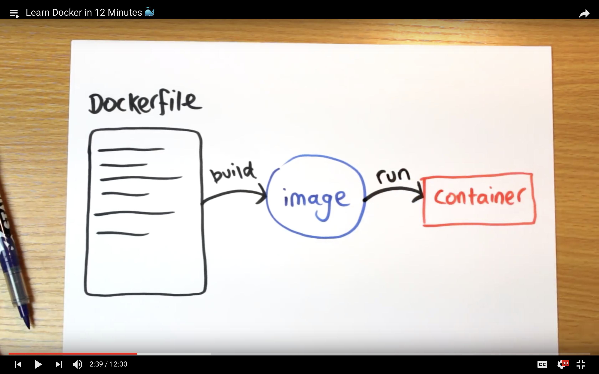

# Concept

An Dockerfile builds an Image which runs a Container



## Docker-Compose

Compose is a tool for defining and running multi-container Docker applications. With Compose, you use a YAML file to configure your application's services

## Commands

```bash
docker build
docker run
docker ps      # show running processes
```

```bash
docker-compose build
docker-compose up [--build] [--detach]
docker-compose stop
docker-compose run {containername} {bin/console cache:clear} 
```
