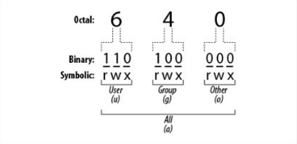

# Shell

## Prompt

`$` for regular prompt
`#` for Superuser

## Help

Search manpages by Keyword
```bash
$ man -k keyword
```

## Wildcards

```bash
$ ls dir/*conf  // null to many characters
$ ls a?         // one character

```


## Environment Variables


List

```bash
$ printenv         //show all Variables
$ printenv MYVAR   //show particular
```


Set

```bash
$ MYVAR = 'SomeValue'
// use export to make it accessible outside this shell
```

Produce

```bash
$ echo $MYVAR

```

## Path

modify Path variable **temporary**. modify userprofile to change permanent
```bash
$ PATH=$PATH:/usr/sbin
$ echo $PATH
/usr/local/bin:/bin:/usr/bin:/home/smith/bin:/usr/sbin”
```

## Alias

define temporary alias
```bash
$ alias ll='ls -l'
$ ll

//list aliases
$ alias
```

## Input, Output & Pipes

```bash
$ wc < words.txt   //input
$ ls > files.txt   //output
$ ls >> files.txt  //add to output

$ ls -l | wc       // pipe
```


## Access Control

### Display diagram


### chmod numeric format



```bash
chmod 640 {filename}
```

### chmod symbolic format

```bash
chmod u+x file.txt #adds execute for user
chmod -w file.txt #removes write from all
```

**u** ser, **g** roup, **o** thers / **r** ead, **w** rite, **e** xecute

## change owner/group

```bash
$ chown smith file1 file2 dir1
$ chgrp smith file3

```
