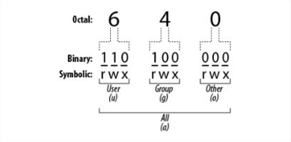

#Shell

##Environment Variables

Show
```bash
printenv
printenv MYVAR
```

Set
```bash
MYVAR = 'SomeValue'
```

Produce value of variable
```bash
echo $MYVAR
```

##Access Control

###chmod numeric format


```bash
chmod 640 {filename}
```

###chmod symbolic format

```bash
chmod u+x file.txt #adds execute for user
chmod -w file.txt #removes write from all
```
**u**ser, **g**roup, **o**thers / **r**ead, **w**rite, **e**xecute